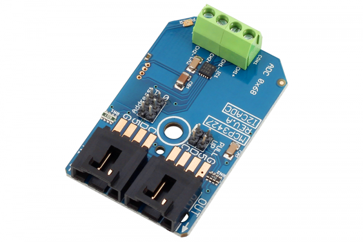

# MCP3427

The MCP3427 is a 2-Channel Analog to Digital Converter with 16-Bit resolution, ideally suited for low-speed high-resolution sensor monitoring.The MCP3427 is capable of reading analog voltages at 15 samples per second with 16-Bit resolution or 240 samples per second at 12-bit resolution.
This Device is available from www.ncd.io 

[SKU: MCP3427_I2CS]

(https://store.ncd.io/product/mcp3427-16-bit-2-channel-analog-to-digital-converter-i2c-mini-module/)
This Sample code can be used with Arduino.

Hardware needed to interface MCP3427 sensor with Arduino

1. <a href="https://store.ncd.io/product/i2c-shield-for-arduino-nano/">Arduino Nano</a>

2. <a href="https://store.ncd.io/product/i2c-shield-for-arduino-micro-with-i2c-expansion-port/">Arduino Micro</a>

3. <a href="https://store.ncd.io/product/i2c-shield-for-arduino-uno/">Arduino uno</a>

4. <a href="https://store.ncd.io/product/dual-i2c-shield-for-arduino-due-with-modular-communications-interface/">Arduino Due</a>

5. <a href="https://store.ncd.io/product/mcp3427-16-bit-2-channel-analog-to-digital-converter-i2c-mini-module/">MCP3427 16-Bit 2-Channel Analog to Digital Converter</a>

6. <a href="https://store.ncd.io/product/i%C2%B2c-cable/">I2C Cable</a>

MCP3427:

The MCP3427 is a 2-Channel Analog to Digital Converter with 16-Bit resolution, ideally suited for low-speed high-resolution sensor monitoring.The MCP3427 is capable of reading analog voltages at 15 samples per second with 16-Bit resolution or 240 samples per second at 12-bit resolution.

Applications:

• Portable Instrumentation and Consumer Goods

• Temperature Sensing with RTD, Thermistor, and Thermocouple

• Bridge Sensing for Pressure, Strain, and Force

• Weigh Scales and Battery Fuel Gauges

• Factory Automation Equipment

How to Use the MCP3427 Arduino Library

The MCP3427 has a number of settings, which can be configured based on user requirements.
          
1.Configuration setting:The following command is used to set the configurations of MCP3427 sensor.

              MCP.SetConfiguration(2,12,0,1);
            
2.Output measurement:The following command is used to measure the output of ADC.

              Raw_ADC = MCP.readADC();
